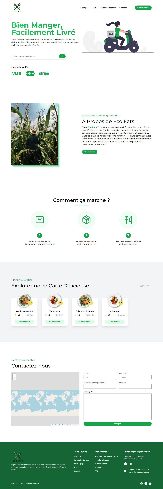

# Eco Eats™ 

Landing page integration for fictional startup Eco Eats™. Made with Tailwind.


## Run Locally

Clone the project

```bash
  git clone https://github.com/Khaledik/eco-eats
```


## Tech Stack

**Client:** HTML, CSS, TailwindCSS


## Color Reference

| Color             | Hex                                                                |
| ----------------- | ------------------------------------------------------------------ |
| green-100 |  #a6ecbf |
| green-600 |  #16a34a |
| green-800 |  #166534 |


## Screenshots



